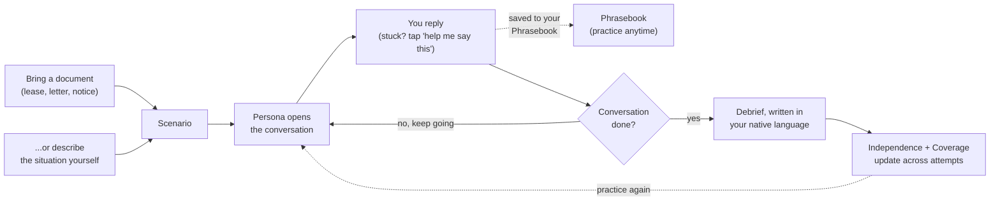

<!-- <p align="center">
  
</p> -->

# Leena <p align="center">
  
</p>

**You don't get a second take on the call where you ask your landlord not to
raise the rent. Leena is where you get twenty.**

It's a rehearsal partner for the English conversations immigrants have to
get right on the first try — the doctor's office, the USCIS interview, the
parent-teacher conference, the letter you don't fully understand. The bet
underneath it: for most of this audience, fluency isn't the blocker.
Confidence under pressure is. Someone who reads and writes English
competently can still freeze on the phone with a landlord, because no
classroom rehearsed *that specific conversation* — its vocabulary, its
back-and-forth, the exact moment you have to ask someone to repeat
themselves without it costing you the room.

Bring a document, or just describe the situation. Leena builds a roleplay
partner for it, lets you run it as many times as you need, and tracks two
things across every attempt: how much of it you handled on your own, and how
ready you are for the conversations you said actually matter to you.

Your native language runs through all of it, not just onboarding. Set it
once, and every debrief is written in it, not translated into it afterward.
Go blank mid-conversation and "help me say this" gives you the English line
you need, in the moment — and every phrase you've ever asked for is saved to
a phrasebook you can revisit and practice out loud on its own, independent
of any one conversation.

## How a rehearsal works



The persona always opens — never a blank screen, exactly like the real
conversation would go.

## Repo layout

An npm workspace, two deployables, one shared contract:

```
app/               React Native (Expo) client — the product
server/            Express + Prisma + Postgres API — owns the practice
                   record and every AI call
packages/shared/   TypeScript types shared by both — the DTO contract
```

Each has its own README with the actual engineering detail:
[`app/README.md`](app/README.md) · [`server/README.md`](server/README.md).
This file stays at the product level; go there for architecture!

## Running it

```bash
npm install                      # from the repo root — installs both workspaces

# server, in one terminal
cd server
npx prisma db push               # one-time: point DATABASE_URL at a local Postgres first
npm run dev                      # localhost:4000

# app, in another terminal
cd app
npm start                        # scan the QR with Expo Go, or press i / a / w
```

The app ships pointed at the deployed server
(`EXPO_PUBLIC_API_BASE_URL` in `app/.env`) so it works out of the box without
running the server locally at all. Point it at `localhost:4000` only when
you're actually changing server code.

## Why it's built this way

Four decisions that shape everything downstream, made with a specific user
in mind — someone already anxious about being misunderstood, opening an app
for the first time, on a phone, possibly mid-crisis about a letter they got
that day:

**No accounts.** Onboarding asks one question — your native language — and
nothing else. The cost is real: identity is bound to a device install, no
recovery, no multi-device sync. For this audience that trade is correct — a
locked-out applicant abandoning the app at a password-reset screen is a
worse outcome than the data-portability gap.

**Native language is a first-class input, not a locale setting.** It's the
one thing onboarding asks for, and it shapes every explanation the app
gives back — document breakdowns, mid-conversation help, end-of-session
debriefs. All of it is generated directly in that language, never
translated after the fact from an English draft: a document explanation
that reads like a machine translated it defeats the purpose for someone
already worried about being talked down to.

**Asking for clarification is never scored as a failure.** It's the single
behavior the product exists to build — this audience already under-rehearses
"sorry, can you say that again?" because it feels like admitting they didn't
understand. The metrics are built so saying it never counts against you.
See *Independence* in [`server/README.md`](server/README.md#the-metrics-layer)
for how that's enforced in code, not just in copy.

**The server owns every model call; the app never talks to a provider
directly.** Keys stay server-side, a provider swap touches no client code,
and an app-store review cycle can't ship a stale prompt.

Nothing here is hidden behind a comment saying `// TODO`. Both sub-READMEs
keep an honest "known gaps" section for exactly the things a first read
would otherwise have to rediscover the hard way.
